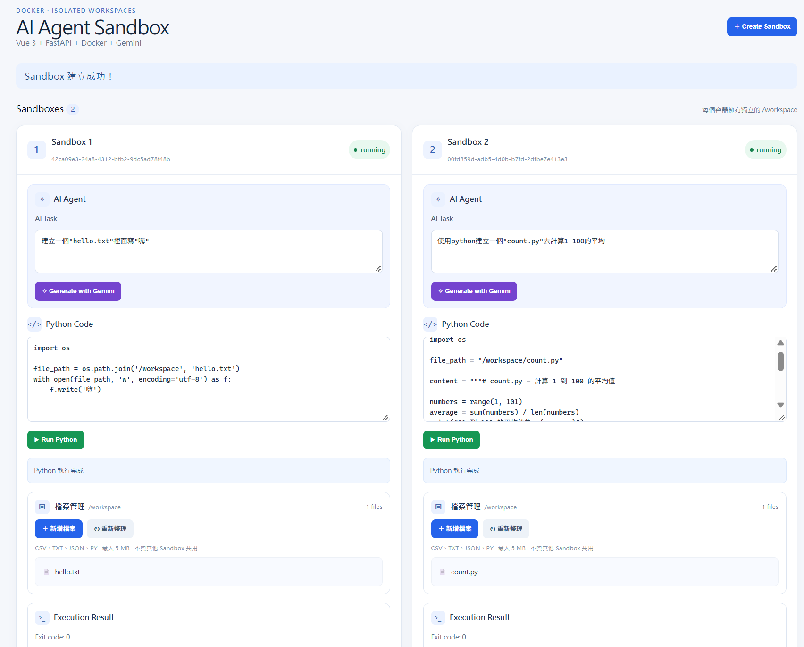

# AI Agent Sandbox

這是一個使用 Vue 3、FastAPI、Docker 與 Gemini API 建立的 AI Agent Sandbox Demo。

使用者可以透過前端建立多個獨立的 Sandbox，輸入任務讓 Gemini 產生 Python 程式碼，確認程式碼後，再於指定的 Docker Sandbox 中執行。

每個 Sandbox 使用獨立的 Docker Container，讓不同 Sandbox 的執行環境與檔案彼此隔離。

## Demo



上圖同時建立兩個獨立 Sandbox，分別執行不同的 AI Task。
每個 Sandbox 擁有獨立的 `/workspace`，彼此不共用檔案。


## 主要功能

- 建立與刪除 Sandbox
- 同時建立多個獨立 Sandbox
- 使用 Gemini API 根據自然語言產生 Python 程式碼
- 在指定 Sandbox 中執行 Python
- 顯示程式執行結果
- 上傳檔案至指定 Sandbox
- 查看各 Sandbox `/workspace` 中的檔案
- 不同 Sandbox 之間的檔案隔離
- 刪除 Sandbox 時一併移除 Container 內的資料
- Python 程式執行時間限制
- Sandbox CPU、Memory、PID 數量限制
- 關閉 Sandbox 外部網路

## 系統架構

```text
                    User
                      │
                      ▼
                Vue 3 Frontend
                      │
                      ▼
               FastAPI Backend
                 /          \
                /            \
               ▼              ▼
         Gemini API      Docker Engine
                              │
                    ┌─────────┴─────────┐
                    ▼                   ▼
               Sandbox A           Sandbox B
              /workspace          /workspace
                    │                   │
                    └── Data Isolation ─┘
```

### Frontend

使用 Vue 3 + Vite 建立操作介面，提供：

- 建立 / 刪除 Sandbox
- 輸入 AI Task
- 顯示 Gemini 產生的 Python 程式碼
- 執行 Python
- 顯示執行結果
- 上傳及查看 Sandbox 中的檔案

### Backend

使用 FastAPI 建立 API，負責：

- Sandbox lifecycle 管理
- Gemini API 呼叫
- Python 程式執行
- Sandbox 檔案管理

### Sandbox

每個 Sandbox 對應一個獨立的 Docker Container。

目前設定包含：

- Python 3.12
- Memory limit：256 MB
- CPU limit：0.5 CPU
- PID limit：64
- Network disabled
- Drop Linux capabilities
- `no-new-privileges`
- Python execution timeout
- `/workspace` 作為使用者檔案的主要工作目錄

## Sandbox 資料隔離

不同 Sandbox 使用不同的 Docker Container，因此不共用 Container filesystem。

例如，在 Sandbox A 建立：

```text
/workspace/hello.txt
```

Sandbox B 無法直接讀取 Sandbox A 的 `hello.txt`。

目前已實際測試：

1. 在 Sandbox A 建立檔案
2. 在 Sandbox B 嘗試讀取相同路徑
3. Sandbox B 無法取得 Sandbox A 的檔案
4. 上傳至 Sandbox A 的檔案無法由 Sandbox B 直接讀取
5. 刪除 Sandbox 時，對應的 Docker Container 一併刪除
6. 新建立的 Sandbox 不會包含其他 Sandbox 的檔案

## Gemini Code Generation

使用者可以輸入自然語言任務，例如：

```text
建立一個 hello.txt，內容寫入 Hello Gemini
```

系統透過 Gemini API 產生 Python 程式碼。

產生的程式碼不會直接自動執行，使用者可以先查看程式碼，再決定是否於指定 Sandbox 中執行。

如果沒有指定檔案路徑，系統以 `/workspace` 作為主要工作目錄，讓 Gemini 產生的檔案與使用者上傳的檔案可以在同一個位置管理。

## 專案結構

```text
ai-agent-sandbox/
│
├── main.py
├── sandbox_manager.py
├── agent.py
├── list_models.py
├── test_gemini.py
├── requirements.txt
├── .env.example
├── .gitignore
│
├── frontend/
│   └── ...
│
└── static/
    └── ...
```

## 執行環境

需要：

- Linux / WSL2
- Python 3
- Docker
- Node.js
- Gemini API Key

## Backend 啟動

建立 Python virtual environment：

```bash
python3 -m venv .venv
source .venv/bin/activate
```

安裝 Python 套件：

```bash
pip install -r requirements.txt
```

建立環境變數設定：

```bash
cp .env.example .env
```

在 `.env` 中填入自己的 Gemini API Key 與 Model：

```text
GEMINI_API_KEY=your_gemini_api_key
GEMINI_MODEL=your_gemini_model
```

確認 Docker 正常運作：

```bash
docker ps
```

啟動 FastAPI：

```bash
uvicorn main:app --reload --host 127.0.0.1 --port 8000
```

API 文件：

```text
http://localhost:8000/docs
```

## Frontend 啟動

開啟另一個 Terminal：

```bash
cd frontend
npm install
npm run dev
```

再依照 Vite 顯示的網址開啟前端，例如：

```text
http://localhost:5173
```

## Demo Flow

1. 建立 Sandbox A 與 Sandbox B
2. 輸入自然語言 Task，透過 Gemini 產生 Python 程式碼
3. 確認程式碼後，在 Sandbox A 執行
4. 在 Sandbox A 的 `/workspace` 建立檔案
5. 確認檔案出現在 Sandbox A
6. 在 Sandbox B 嘗試讀取相同檔案，確認無法取得
7. 測試將本機檔案上傳至指定 Sandbox
8. 刪除 Sandbox

## 目前限制

此專案目前以 AI Agent Sandbox 功能實作與 Demo 為主要目的，尚未作為正式 Production Service 部署。

目前尚未實作：

- 使用者登入與權限管理
- HTTPS / Reverse Proxy
- Sandbox 自動過期與清理機制
- 完整的 Production Security 設計

目前的 Docker Container 設定提供基本的執行環境與檔案隔離，但不代表可以安全執行所有不受信任的惡意程式碼。

## 後續改善方向

- HTTPS / Nginx Reverse Proxy
- 使用者驗證與權限管理
- Sandbox expiration / lifecycle management
- 更完整的 Sandbox security policy
- 檔案下載與刪除
- Execution history / log
- 更完整的錯誤處理

## for yuwen

### Linux 指令

把資料夾在vscode開啟
```
code .
```
開啟資料夾路徑
```
explorer.exe .
\\wsl$\Ubuntu\home\tiffany\ai-agent-sandbox
```
確認docker連線
```
docker ps
```

### 啟動 FastAPI 後端(ubuntu 1)
```
cd ~/ai-agent-sandbox
source .venv/bin/activate
uvicorn main:app --reload --host 127.0.0.1 --port 8000
```
### 啟動 Vue 前端(ubuntu 2)
```
cd ~/ai-agent-sandbox/frontend
npm run dev
```